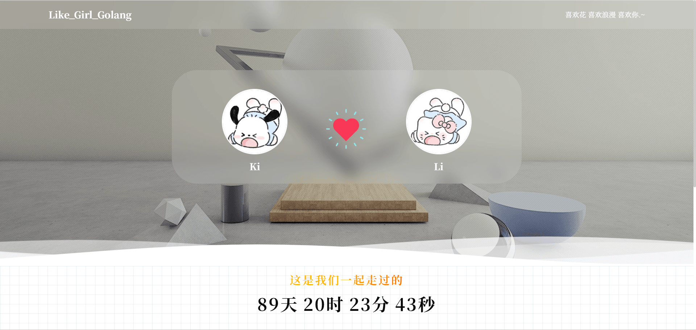
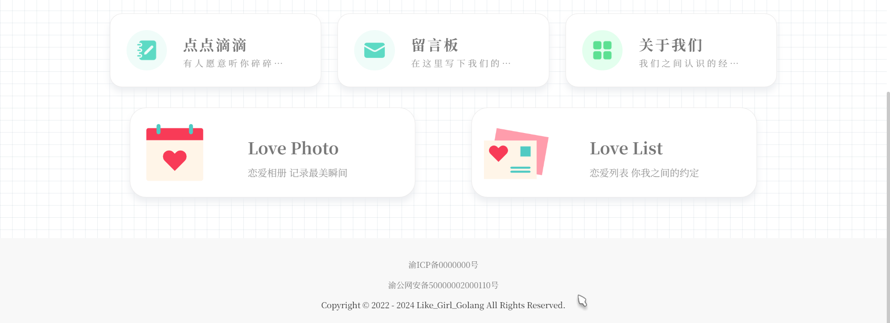
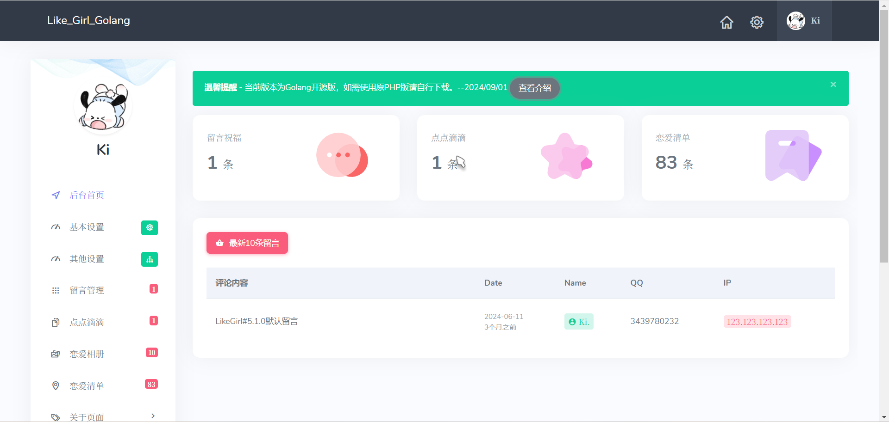
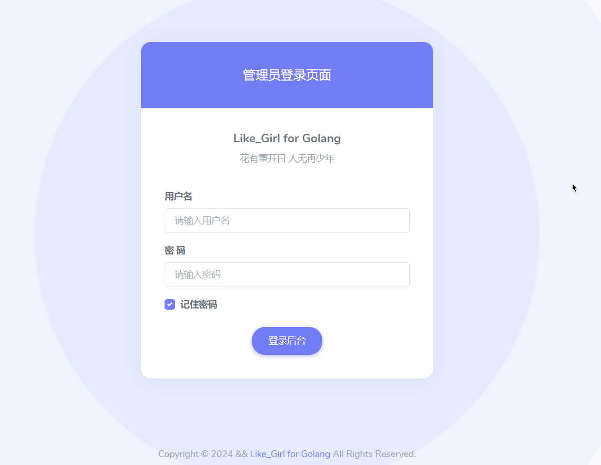
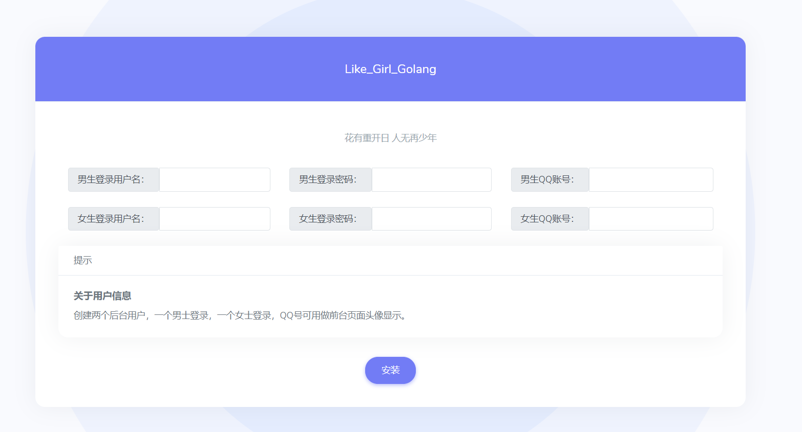
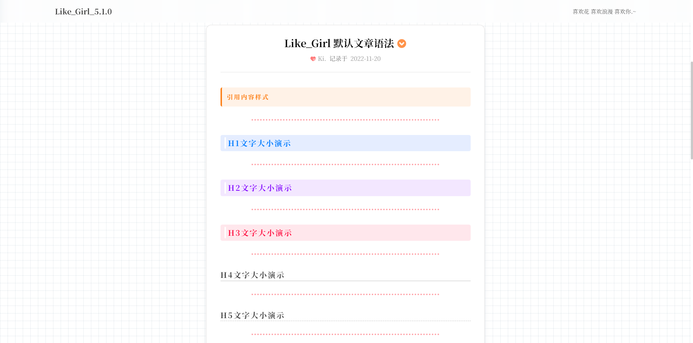
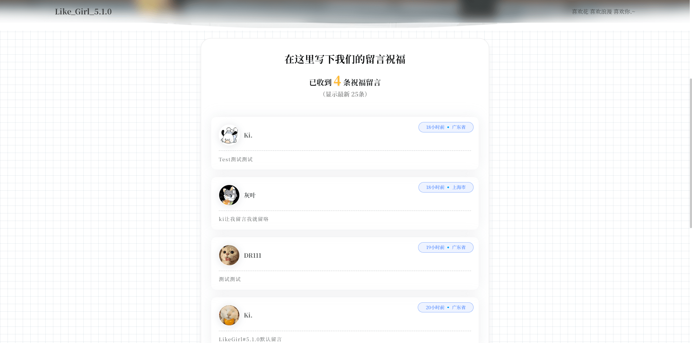
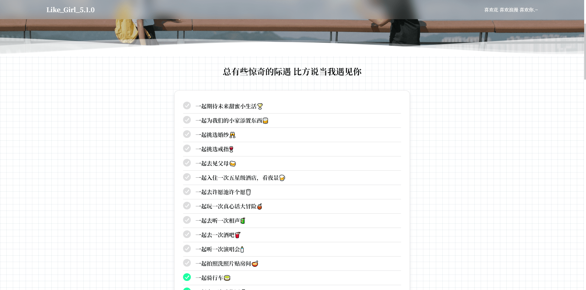

## Girl Like For Golang

这是一个情侣小站，该项目前端UI主要基于PHP版的 **Like_Girl V5.1.0** ，如需PHP版本请到[https://gitee.com/kiCode111/LikeGirl_5.1.0](https://gitee.com/kiCode111/LikeGirl_5.1.0https://gitee.com/kiCode111/LikeGirl_5.1.0)自行下载。

## ✨效果预览

#### 主页





#### 后台页面



#### 后台登录页面



#### 安装页面



#### 其他页面







## ⚙️部署

#### 使用二进制程序直接部署

下载适合您的目标机器操作系统、CPU 架构的主要二进制文件并直接运行。

```bash
tar -zxvf girl_OS_ARCH.zip

chmod +x ./girl

./girl
```

#### 使用 Docker 部署

##### Docker

```bash
docker run -p 5200:5200 -d -v ./data:/Girl/data --restart=always --name girl kukudebai/girl:latest
```

##### Docker-compose

```yaml
version: '3'
services:
    girl:
        image: 'kukudebai/girl:latest'
        container_name: girl
        restart: always
        volumes:
            - './data:/Girl/data'
        ports:
            - '5200:5200'


```

## 🛠️构建

Golang 环境要求 `>=` 1.23.0

#### 安装 goreleaser

```shell
go install github.com/goreleaser/goreleaser/v2@latest
```

#### Clone 本仓库

```shell
git clone https://github.com/lovebai/Girl.git
```

#### 编译

```shell
goreleaser build --clean --single-target --snapshot
```

## 🗒️文档

[https://obai.cc/ji-shu/Like_Girl_For_Golang.html](https://obai.cc/ji-shu/Like_Girl_For_Golang.html "[https://obai.cc/ji-shu/Like_Girl_For_Golang.html](https://obai.cc/ji-shu/Like_Girl_For_Golang.html)")

## 技术栈

Go、 Gin、 Gorm、  Bootstrap、 Javascript、 Css、 Html
